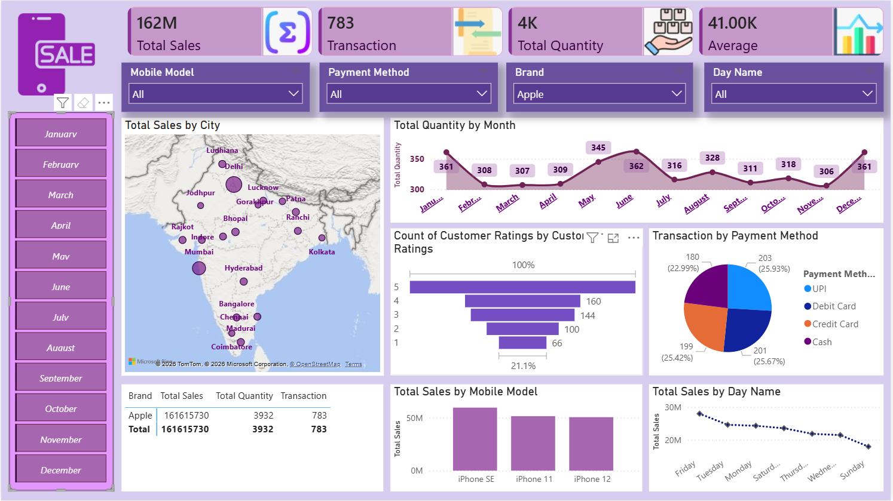
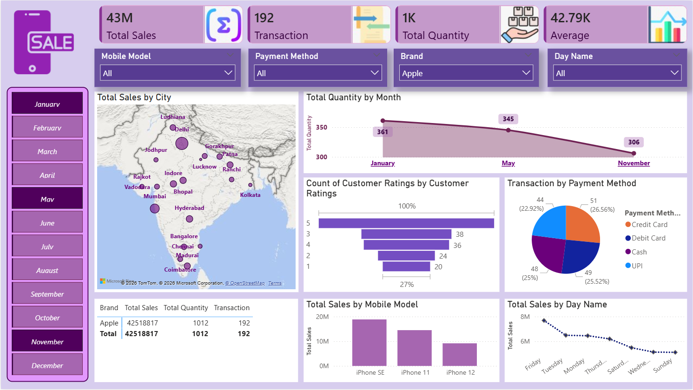
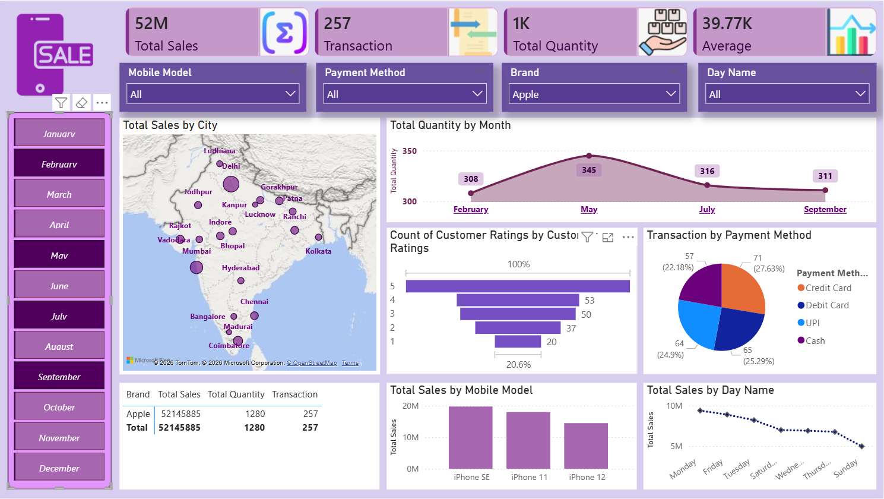

# 📊 Mobile Sales Analytics Dashboard  


---

## 🚀 Project Overview
This project delivers a **high-performance Power BI dashboard** focused on mobile sales analytics.  

It converts raw transactional data into **actionable business intelligence**, enabling stakeholders to monitor KPIs, identify trends, and drive data-backed decisions.

---

## 🎯 Business Problem
Retail businesses struggle with:
- Lack of **centralized sales visibility**
- Difficulty tracking **product performance**
- Limited understanding of **customer behavior & payment trends**

### ✅ Solution
An **interactive, filter-driven dashboard** that provides:
- Real-time KPI tracking  
- Multi-dimensional analysis  
- Intuitive visual storytelling  

---

## 📌 Dashboard Capabilities

### 📈 KPI Layer
- 💰 Total Sales  
- 🔄 Total Transactions  
- 📦 Total Quantity  
- 📊 Average Sales  

### 🌍 Geo Intelligence
- City-level performance using map visualization  

### 📅 Time Intelligence
- Monthly trend analysis  
- Day-wise sales performance  

### 📱 Product Analytics
- Brand comparison  
- Top-performing mobile models  

### 💳 Payment Insights
- UPI vs Debit vs Credit vs Cash distribution  

### ⭐ Customer Insights
- Ratings distribution analysis  

### 🎛️ Dynamic Slicers
- Brand  
- Model  
- Month  
- Payment Method  
- Day Name  

---

## 📐 Key DAX Measures

```DAX
Total Sales = SUM(Sales[Total_Sales])

Total Quantity = SUM(Sales[Quantity])

Total Transactions = COUNT(Sales[Transaction_ID])

Average Sales = DIVIDE([Total Sales], [Total Transactions])

Top Brand Sales = 
CALCULATE(
    [Total Sales],
    FILTER(Sales, Sales[Brand] = "Apple")
)
```

## 🖼️ Dashboard Preview

### 🔹 Main Dashboard


### 🔹 Filter Interaction View


### 🔹Another Interactive View


---

## 🛠️ Tech Stack

| Technology     | Usage |
|---------------|------|
| Power BI      | Dashboard Development |
| DAX           | KPI Calculations |
| Power Query   | Data Cleaning & Transformation |
| Excel         | Data Source |

---

## 🧠 Key Business Insights
- 📍 Metro cities dominate revenue contribution  
- 📊 A small set of products drives majority sales (Pareto effect)  
- 💳 Digital payments lead transaction share  
- 📅 Seasonal fluctuations observed in monthly trends  
- ⭐ Customer satisfaction trends are largely positive  

## ⚙️ How to Run
1. Clone the repository  
2. Open `.pbix` file in Power BI Desktop  
3. Interact with filters & visuals  
4. Explore insights  

---

## 💼 Why This Project Stands Out
✔ End-to-end analytics solution  
✔ Strong business storytelling  
✔ Clean UI/UX dashboard design  
✔ Practical use of DAX & data modeling  

---

## ⭐ Support
If this project adds value, consider giving it a ⭐
